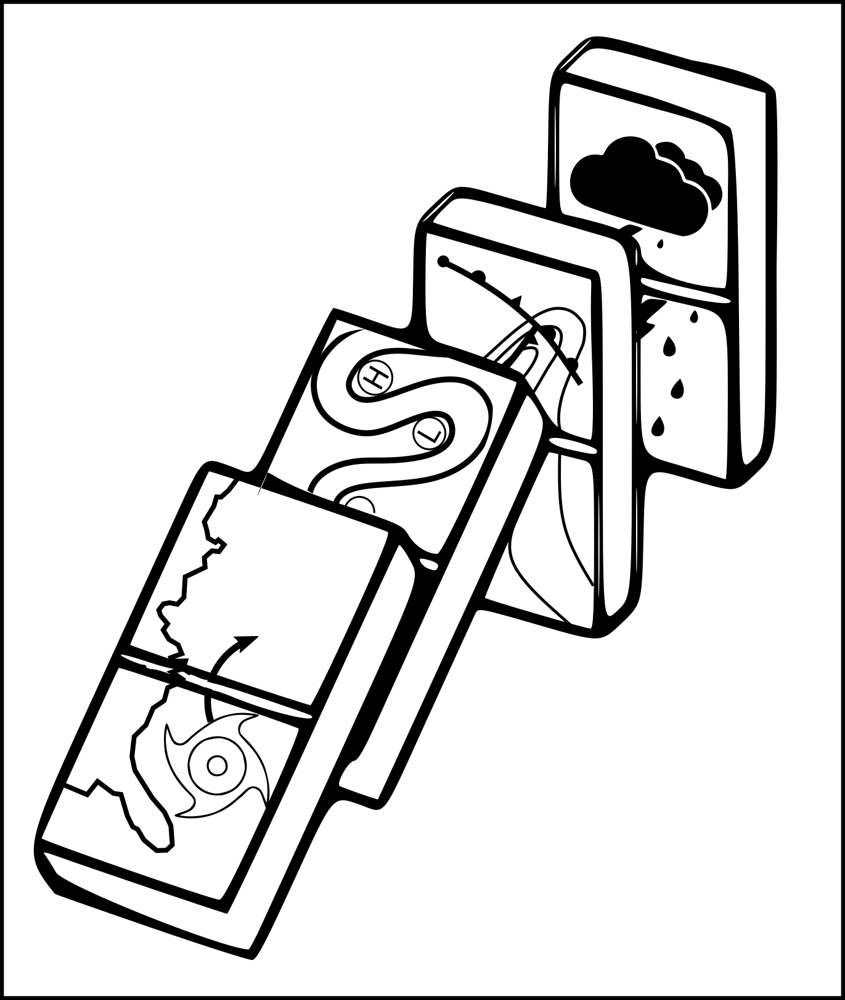

# Domino is a package for analysing the atmospheric precursors of categorical events: meteorological or impact-based.
## Built on top of xarray, Domino makes it easy to calculate lagged composites of fields and scalar indices around categorical event time series, to compute bootstrapped confidence bounds, to produce scalar indices of precursor activity, and to assess their predictive skill.

## This is a beta release. While core functionality is stable, there may be some bugs: please contact me at joshua.dorrington@uib.no if you encounter unexpected behaviour.




## Documentation

See our [API reference](https://joshdorrington.github.io/docs/domino.html) for a full description of all functionality.

Our paper on Domino and its application to extreme rainfall prediction has been published in QJRMS and can be [found here](https://doi.org/10.1002/qj.4622)

## Examples

See our Jupyter notebook examples for more detailed discussion of how to apply Domino to different use cases.

Our [basic](https://github.com/joshdorrington/domino/blob/master/examples/basic_compositing.ipynb) and [advanced](https://github.com/joshdorrington/domino/blob/master/examples/advanced_compositing.ipynb) compositing guides cover the use of Domino's flexible LaggedAnalyser class to easily compute time-lagged composites and apply bootstrap significance tests to them.

Producing filtered precursor patterns from composites, and computing precursor activity indices from those, is covered in our [Index_Computation guide](https://github.com/joshdorrington/domino/blob/master/examples/precursor_index_computation.ipynb), while an introduction to assessing the predictive power of indices is in the [Index_Predictability guide](https://github.com/joshdorrington/domino/blob/master/examples/Index_Predictability.ipynb).


## Install

domino can be installed using pip:
```
python -m pip install domino-composite
```
If you want to run the worked examples in the Jupyter notebooks you will need to download the [netcdf files containing example data](https://github.com/joshdorrington/domino/releases/tag/v1-data).

## Related papers using Domino or its precursor output:

* [Precursors and pathways: dynamically informed extreme event forecasting demonstrated on the historic Emilia-Romagna 2023 flood](https://doi.org/10.5194/nhess-24-2995-2024)
* [Improving forecasts of precipitation extremes over northern and central Italy using machine learning](https://doi.org/10.1002/qj.4755)
